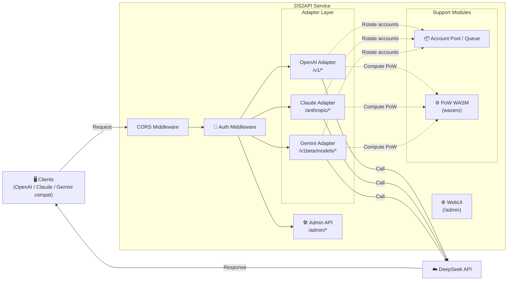

<p align="center">
  
</p>

# DS2API

[](LICENSE)


[](https://github.com/CJackHwang/ds2api/releases)
[](DEPLOY.en.md)
[](https://zeabur.com/templates/L4CFHP)
[](https://vercel.com/new/clone?repository-url=https://github.com/CJackHwang/ds2api)

Language: [中文](README.MD) | [English](README.en.md)

DS2API converts DeepSeek Web chat capability into OpenAI-compatible, Claude-compatible, and Gemini-compatible APIs. The backend is a **pure Go implementation**, with a React WebUI admin panel (source in `webui/`, build output auto-generated to `static/admin` during deployment).

## Architecture Overview



- **Backend**: Go (`cmd/ds2api/`, `api/`, `internal/`), no Python runtime
- **Frontend**: React admin panel (`webui/`), served as static build at runtime
- **Deployment**: local run, Docker, Vercel serverless, Linux systemd

## Key Capabilities

| Capability | Details |
| --- | --- |
| OpenAI compatible | `GET /v1/models`, `GET /v1/models/{id}`, `POST /v1/chat/completions`, `POST /v1/responses`, `GET /v1/responses/{response_id}`, `POST /v1/embeddings` |
| Claude compatible | `GET /anthropic/v1/models`, `POST /anthropic/v1/messages`, `POST /anthropic/v1/messages/count_tokens` (plus shortcut paths `/v1/messages`, `/messages`) |
| Gemini compatible | `POST /v1beta/models/{model}:generateContent`, `POST /v1beta/models/{model}:streamGenerateContent` (plus `/v1/models/{model}:*` paths) |
| Multi-account rotation | Auto token refresh, email/mobile dual login |
| Concurrency control | Per-account in-flight limit + waiting queue, dynamic recommended concurrency |
| DeepSeek PoW | WASM solving via `wazero`, no external Node.js dependency |
| Tool Calling | Anti-leak handling: non-code-block feature match, early `delta.tool_calls`, structured incremental output |
| Admin API | Config management, runtime settings hot-reload, account testing/batch test, import/export, Vercel sync |
| WebUI Admin Panel | SPA at `/admin` (bilingual Chinese/English, dark mode) |
| Health Probes | `GET /healthz` (liveness), `GET /readyz` (readiness) |

## Platform Compatibility Matrix

| Tier | Platform | Status |
| --- | --- | --- |
| P0 | Codex CLI/SDK (`wire_api=chat` / `wire_api=responses`) | ✅ |
| P0 | OpenAI SDK (JS/Python, chat + responses) | ✅ |
| P0 | Vercel AI SDK (openai-compatible) | ✅ |
| P0 | Anthropic SDK (messages) | ✅ |
| P0 | Google Gemini SDK (generateContent) | ✅ |
| P1 | LangChain / LlamaIndex / OpenWebUI (OpenAI-compatible integration) | ✅ |
| P2 | MCP standalone bridge | Planned |

## Model Support

### OpenAI Endpoint

| Model | thinking | search |
| --- | --- | --- |
| `deepseek-chat` | ❌ | ❌ |
| `deepseek-reasoner` | ✅ | ❌ |
| `deepseek-chat-search` | ❌ | ✅ |
| `deepseek-reasoner-search` | ✅ | ✅ |

### Claude Endpoint

| Model | Default Mapping |
| --- | --- |
| `claude-sonnet-4-5` | `deepseek-chat` |
| `claude-haiku-4-5` (compatible with `claude-3-5-haiku-latest`) | `deepseek-chat` |
| `claude-opus-4-6` | `deepseek-reasoner` |

Override mapping via `claude_mapping` or `claude_model_mapping` in config.
In addition, `/anthropic/v1/models` now includes historical Claude 1.x/2.x/3.x/4.x IDs and common aliases for legacy client compatibility.


#### Claude Code integration pitfalls (validated)

- Set `ANTHROPIC_BASE_URL` to the DS2API root URL (for example `http://127.0.0.1:5001`). Claude Code sends requests to `/v1/messages?beta=true`.
- `ANTHROPIC_API_KEY` must match an entry in `keys` from `config.json`. Keeping both a regular key and an `sk-ant-*` style key improves client compatibility.
- If your environment has proxy variables, set `NO_PROXY=127.0.0.1,localhost,<your_host_ip>` for DS2API to avoid proxy interception of local traffic.
- If tool calls are rendered as plain text and not executed, upgrade to a build that includes multi-format Claude tool-call parsing (JSON/XML/ANTML/invoke).

### Gemini Endpoint

The Gemini adapter maps model names to DeepSeek native models via `model_aliases` or built-in heuristics, supporting both `generateContent` and `streamGenerateContent` call patterns with full Tool Calling support (`functionDeclarations` → `functionCall` output).

## Quick Start

### Universal First Step (all deployment modes)

Use `config.json` as the single source of truth (recommended):

```bash
cp config.example.json config.json
# Edit config.json
```

Recommended per deployment mode:
- Local run: read `config.json` directly
- Docker / Vercel: generate Base64 from `config.json` and inject as `DS2API_CONFIG_JSON`

### Option 1: Local Run

**Prerequisites**: Go 1.24+, Node.js 20+ (only if building WebUI locally)

```bash
# 1. Clone
git clone https://github.com/CJackHwang/ds2api.git
cd ds2api

# 2. Configure
cp config.example.json config.json
# Edit config.json with your DeepSeek account info and API keys

# 3. Start
go run ./cmd/ds2api
```

Default URL: `http://localhost:5001`

> **WebUI auto-build**: On first local startup, if `static/admin` is missing, DS2API will auto-run `npm install && npm run build` (requires Node.js). You can also build manually: `./scripts/build-webui.sh`

### Option 2: Docker

```bash
# 1. Prepare env file
cp .env.example .env

# 2. Generate DS2API_CONFIG_JSON from config.json (single-line Base64)
DS2API_CONFIG_JSON="$(base64 < config.json | tr -d '\n')"

# 3. Edit .env and set:
#    DS2API_ADMIN_KEY=replace-with-a-strong-secret
#    DS2API_CONFIG_JSON=${DS2API_CONFIG_JSON}

# 4. Start
docker-compose up -d

# 5. View logs
docker-compose logs -f
```

Rebuild after updates: `docker-compose up -d --build`

#### Zeabur One-Click (Dockerfile)

1. Click the “Deploy on Zeabur” button above to deploy.
2. After deployment, open `/admin` and login with `DS2API_ADMIN_KEY` shown in Zeabur env/template instructions.
3. Import / edit config in Admin UI (it will be written and persisted to `/data/config.json`).

### Option 3: Vercel

1. Fork this repo to your GitHub account
2. Import the project on Vercel
3. Set environment variables (minimum: `DS2API_ADMIN_KEY`; recommended to also set `DS2API_CONFIG_JSON`)
4. Deploy

Recommended first step in repo root:

```bash
cp config.example.json config.json
# Edit config.json
```

Recommended: convert `config.json` to Base64 locally, then paste into `DS2API_CONFIG_JSON` to avoid JSON formatting mistakes:

```bash
base64 < config.json | tr -d '\n'
```

> **Streaming note**: `/v1/chat/completions` on Vercel is routed to `api/chat-stream.js` (Node Runtime) for real-time SSE. Auth, account selection, and session/PoW preparation are still handled by the Go internal prepare endpoint; streaming output (including `tools`) is assembled on Node with Go-aligned anti-leak handling.

For detailed deployment instructions, see the [Deployment Guide](DEPLOY.en.md).

### Option 4: Download Release Binaries

GitHub Actions automatically builds multi-platform archives on each Release:

```bash
# After downloading the archive for your platform
tar -xzf ds2api_<tag>_linux_amd64.tar.gz
cd ds2api_<tag>_linux_amd64
cp config.example.json config.json
# Edit config.json
./ds2api
```

### Option 5: OpenCode CLI

1. Copy the example config:

```bash
cp opencode.json.example opencode.json
```

2. Edit `opencode.json`:
- Set `baseURL` to your DS2API endpoint (for example, `https://your-domain.com/v1`)
- Set `apiKey` to your DS2API key (from `config.keys`)

3. Start OpenCode CLI in the project directory (run `opencode` using your installed method).

> Recommended: use the OpenAI-compatible path (`/v1/*`) via `@ai-sdk/openai-compatible` as shown in the example.
> If your client supports `wire_api`, test both `responses` and `chat`; DS2API supports both paths.

## Configuration

### `config.json` Example

```json
{
  "keys": ["your-api-key-1", "your-api-key-2"],
  "accounts": [
    {
      "email": "user@example.com",
      "password": "your-password",
      "token": ""
    },
    {
      "mobile": "12345678901",
      "password": "your-password",
      "token": ""
    }
  ],
  "model_aliases": {
    "gpt-4o": "deepseek-chat",
    "gpt-5-codex": "deepseek-reasoner",
    "o3": "deepseek-reasoner"
  },
  "compat": {
    "wide_input_strict_output": true
  },
  "toolcall": {
    "mode": "feature_match",
    "early_emit_confidence": "high"
  },
  "responses": {
    "store_ttl_seconds": 900
  },
  "embeddings": {
    "provider": "deterministic"
  },
  "claude_model_mapping": {
    "fast": "deepseek-chat",
    "slow": "deepseek-reasoner"
  },
  "admin": {
    "jwt_expire_hours": 24
  },
  "runtime": {
    "account_max_inflight": 2,
    "account_max_queue": 0,
    "global_max_inflight": 0
  }
}
```

- `keys`: API access keys; clients authenticate via `Authorization: Bearer <key>`
- `accounts`: DeepSeek account list, supports `email` or `mobile` login
- `token`: Leave empty for auto-login on first request; or pre-fill an existing token
- `model_aliases`: Map common model names (GPT/Codex/Claude) to DeepSeek models
- `compat.wide_input_strict_output`: Keep `true` (current default policy)
- `toolcall`: Fixed to feature matching + high-confidence early emit
- `responses.store_ttl_seconds`: In-memory TTL for `/v1/responses/{id}`
- `embeddings.provider`: Embeddings provider (`deterministic/mock/builtin` built-in)
- `claude_model_mapping`: Maps `fast`/`slow` suffixes to corresponding DeepSeek models
- `admin`: Admin panel settings (JWT expiry, password hash, etc.), hot-reloadable via Admin Settings API
- `runtime`: Runtime parameters (concurrency limits, queue sizes), hot-reloadable via Admin Settings API

### Environment Variables

| Variable | Purpose | Default |
| --- | --- | --- |
| `PORT` | Service port | `5001` |
| `LOG_LEVEL` | Log level | `INFO` (`DEBUG`/`WARN`/`ERROR`) |
| `DS2API_ADMIN_KEY` | Admin login key | `admin` |
| `DS2API_JWT_SECRET` | Admin JWT signing secret | Same as `DS2API_ADMIN_KEY` |
| `DS2API_JWT_EXPIRE_HOURS` | Admin JWT TTL in hours | `24` |
| `DS2API_CONFIG_PATH` | Config file path | `config.json` |
| `DS2API_CONFIG_JSON` | Inline config (JSON or Base64) | — |
| `DS2API_WASM_PATH` | PoW WASM file path | Auto-detect |
| `DS2API_STATIC_ADMIN_DIR` | Admin static assets dir | `static/admin` |
| `DS2API_AUTO_BUILD_WEBUI` | Auto-build WebUI on startup | Enabled locally, disabled on Vercel |
| `DS2API_ACCOUNT_MAX_INFLIGHT` | Max in-flight requests per account | `2` |
| `DS2API_ACCOUNT_CONCURRENCY` | Alias (legacy compat) | — |
| `DS2API_ACCOUNT_MAX_QUEUE` | Waiting queue limit | `recommended_concurrency` |
| `DS2API_ACCOUNT_QUEUE_SIZE` | Alias (legacy compat) | — |
| `DS2API_GLOBAL_MAX_INFLIGHT` | Global max in-flight requests | `recommended_concurrency` |
| `DS2API_MAX_INFLIGHT` | Alias (legacy compat) | — |
| `DS2API_VERCEL_INTERNAL_SECRET` | Vercel hybrid streaming internal auth | Falls back to `DS2API_ADMIN_KEY` |
| `DS2API_VERCEL_STREAM_LEASE_TTL_SECONDS` | Stream lease TTL seconds | `900` |
| `DS2API_DEV_PACKET_CAPTURE` | Local dev packet capture switch (record recent request/response bodies) | Enabled by default on non-Vercel local runtime |
| `DS2API_DEV_PACKET_CAPTURE_LIMIT` | Number of captured sessions to retain (auto-evict overflow) | `5` |
| `DS2API_DEV_PACKET_CAPTURE_MAX_BODY_BYTES` | Max recorded bytes per captured response body | `2097152` |
| `VERCEL_TOKEN` | Vercel sync token | — |
| `VERCEL_PROJECT_ID` | Vercel project ID | — |
| `VERCEL_TEAM_ID` | Vercel team ID | — |
| `DS2API_VERCEL_PROTECTION_BYPASS` | Vercel deployment protection bypass for internal Node→Go calls | — |

## Authentication Modes

For business endpoints (`/v1/*`, `/anthropic/*`, Gemini routes), DS2API supports two modes:

| Mode | Description |
| --- | --- |
| **Managed account** | Use a key from `config.keys` via `Authorization: Bearer ...` or `x-api-key`; DS2API auto-selects an account |
| **Direct token** | If the token is not in `config.keys`, DS2API treats it as a DeepSeek token directly |

Optional header `X-Ds2-Target-Account`: Pin a specific managed account (value is email or mobile).

## Concurrency Model

```
Per-account inflight = DS2API_ACCOUNT_MAX_INFLIGHT (default 2)
Recommended concurrency = account_count × per_account_inflight
Queue limit = DS2API_ACCOUNT_MAX_QUEUE (default = recommended concurrency)
429 threshold = inflight + queue ≈ account_count × 4
```

- When inflight slots are full, requests enter a waiting queue — **no immediate 429**
- 429 is returned only when total load exceeds inflight + queue capacity
- `GET /admin/queue/status` returns real-time concurrency state

## Tool Call Adaptation

When `tools` is present in the request, DS2API performs anti-leak handling:

1. Toolcall feature matching is enabled only in **non-code-block context** (fenced examples are ignored)
   - In non-code-block context, tool JSON may still be recognized even when mixed with normal prose; surrounding prose can remain as text output.
2. `responses` streaming strictly uses official item lifecycle events (`response.output_item.*`, `response.content_part.*`, `response.function_call_arguments.*`)
3. Tool names not declared in the `tools` schema are strictly rejected and will not be emitted as valid tool calls
4. `responses` supports and enforces `tool_choice` (`auto`/`none`/`required`/forced function); `required` violations return `422` for non-stream and `response.failed` for stream
5. Valid tool call events are only emitted after passing policy validation, preventing invalid tool names from entering the client execution chain

## Local Dev Packet Capture

This is for debugging issues such as Responses reasoning streaming and tool-call handoff. When enabled, DS2API stores the latest N DeepSeek conversation payload pairs (request body + upstream response body), defaulting to 5 entries with auto-eviction.

Enable example:

```bash
DS2API_DEV_PACKET_CAPTURE=true \
DS2API_DEV_PACKET_CAPTURE_LIMIT=5 \
go run ./cmd/ds2api
```

Inspect/clear (Admin JWT required):

- `GET /admin/dev/captures`: list captured items (newest first)
- `DELETE /admin/dev/captures`: clear captured items

Response fields include:

- `request_body`: full payload sent to DeepSeek
- `response_body`: concatenated raw upstream stream body text
- `response_truncated`: whether body-size truncation happened

## Project Structure

```text
ds2api/
├── cmd/
│   ├── ds2api/              # Local / container entrypoint
│   └── ds2api-tests/        # End-to-end testsuite entrypoint
├── api/
│   ├── index.go             # Vercel Serverless Go entry
│   ├── chat-stream.js       # Vercel Node.js stream relay
│   └── helpers/             # Node.js helper modules
├── internal/
│   ├── account/             # Account pool and concurrency queue
│   ├── adapter/
│   │   ├── openai/          # OpenAI adapter (incl. tool call parsing, Vercel stream prepare/release)
│   │   ├── claude/          # Claude adapter
│   │   └── gemini/          # Gemini adapter (generateContent / streamGenerateContent)
│   ├── admin/               # Admin API handlers (incl. Settings hot-reload)
│   ├── auth/                # Auth and JWT
│   ├── claudeconv/          # Claude message format conversion
│   ├── compat/              # Compatibility helpers
│   ├── config/              # Config loading and hot-reload
│   ├── deepseek/            # DeepSeek API client, PoW WASM
│   ├── devcapture/          # Dev packet capture module
│   ├── format/              # Output formatting
│   ├── prompt/              # Prompt construction
│   ├── server/              # HTTP routing and middleware (chi router)
│   ├── sse/                 # SSE parsing utilities
│   ├── stream/              # Unified stream consumption engine
│   ├── util/                # Common utilities
│   └── webui/               # WebUI static file serving and auto-build
├── webui/                   # React WebUI source (Vite + Tailwind)
│   └── src/
│       ├── components/      # AccountManager / ApiTester / BatchImport / VercelSync / Login / LandingPage
│       └── locales/         # Language packs (zh.json / en.json)
├── scripts/
│   └── build-webui.sh       # Manual WebUI build script
├── tests/
│   ├── compat/              # Compatibility fixtures and expected outputs
│   └── scripts/             # Unified test script entrypoints (unit/e2e)
├── static/admin/            # WebUI build output (not committed to Git)
├── .github/
│   ├── workflows/           # GitHub Actions (quality gates + release automation)
│   ├── ISSUE_TEMPLATE/      # Issue templates
│   └── PULL_REQUEST_TEMPLATE.md
├── config.example.json      # Config file template
├── .env.example             # Environment variable template
├── Dockerfile               # Multi-stage build (WebUI + Go)
├── docker-compose.yml       # Production Docker Compose
├── docker-compose.dev.yml   # Development Docker Compose
├── vercel.json              # Vercel routing and build config
└── go.mod / go.sum          # Go module dependencies
```

## Documentation Index

| Document | Description |
| --- | --- |
| [API.md](API.md) / [API.en.md](API.en.md) | API reference with request/response examples |
| [DEPLOY.md](DEPLOY.md) / [DEPLOY.en.md](DEPLOY.en.md) | Deployment guide (local/Docker/Vercel/systemd) |
| [CONTRIBUTING.md](CONTRIBUTING.md) / [CONTRIBUTING.en.md](CONTRIBUTING.en.md) | Contributing guide |
| [TESTING.md](TESTING.md) | Testsuite guide |

## Testing

```bash
# Unit tests (Go + Node)
./tests/scripts/run-unit-all.sh

# One-command live end-to-end tests (real accounts, full request/response logs)
./tests/scripts/run-live.sh

# Or with custom flags
go run ./cmd/ds2api-tests \
  --config config.json \
  --admin-key admin \
  --out artifacts/testsuite \
  --timeout 120 \
  --retries 2
```

```bash
# Release-blocking gates
./tests/scripts/check-stage6-manual-smoke.sh
./tests/scripts/check-refactor-line-gate.sh
./tests/scripts/run-unit-all.sh
npm ci --prefix webui && npm run build --prefix webui
```

## Release Artifact Automation (GitHub Actions)

Workflow: `.github/workflows/release-artifacts.yml`

- **Trigger**: only on GitHub Release `published` (normal pushes do not trigger builds)
- **Outputs**: multi-platform archives (`linux/amd64`, `linux/arm64`, `darwin/amd64`, `darwin/arm64`, `windows/amd64`) + `sha256sums.txt`
- **Container publishing**: GHCR only (`ghcr.io/cjackhwang/ds2api`)
- **Each archive includes**: `ds2api` executable, `static/admin`, WASM file, config template, README, LICENSE

## Disclaimer

This project is built through reverse engineering and is provided for learning and research only. Stability is not guaranteed. Do not use it in scenarios that violate terms of service or laws.
